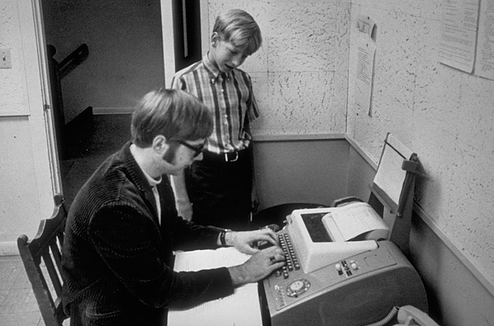

You've got an entire lab to do and you're stuck without a GUI.

<small>*You did close Eclipse, right?*</small>

It looks like we'll have to use the Terminal (also called the shell or command line). *That's alright*, this used to be the only way to use a computer! Many computer programmers regularly use the shell because it can be such a powerful tool.

#### Overview

This week you'll only need the Terminal application and this guide. We're going to go over the UNIX terminal commands you've seen before, along with some new ones. You'll learn how to ...

* Access remote machines
* Move around in the filesystem
* Create and delete directories
* Edit files
* Find and process files quickly

... all without a GUI. Once you know your way around, you'll learn how to create Java packages. Finally, you'll get a chance to play with a few *easter eggs* in the Terminal.
